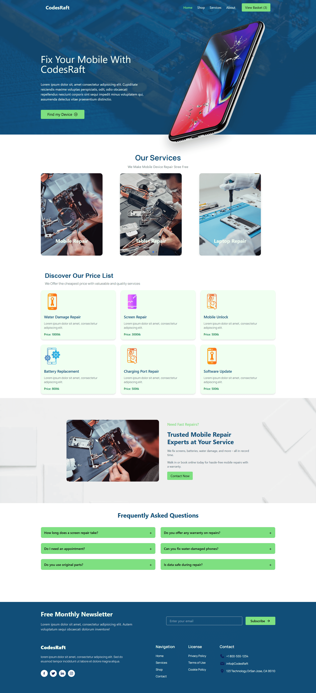

# React + Vite

# Mobile Repair Business Website | CodesRaft

## Live Demo Links

🚀 [View Live Project: Vercel](https://codesraft.vercel.app/)

## Project Screenshot



## Description

This project was built as part of a technical interview for a React Developer position. It demonstrates proficiency in modern frontend technologies and UI libraries.

## Technologies Used

### Frontend

- React.js v19.1
- Tailwind CSS v4.1
- GSAP Animation
- React-Router-7

### Backend

- No backend being used during the project

### Deployment

- Vercel
- GitHub

## Tools overview

- gsap
- react-icon
- Swiper
- React-router-7

## Responsiveness

- Desktop - 1140px

## License

This project is licensed under the MIT License - see the [LICENSE](LICENSE) file for details.

```

```
